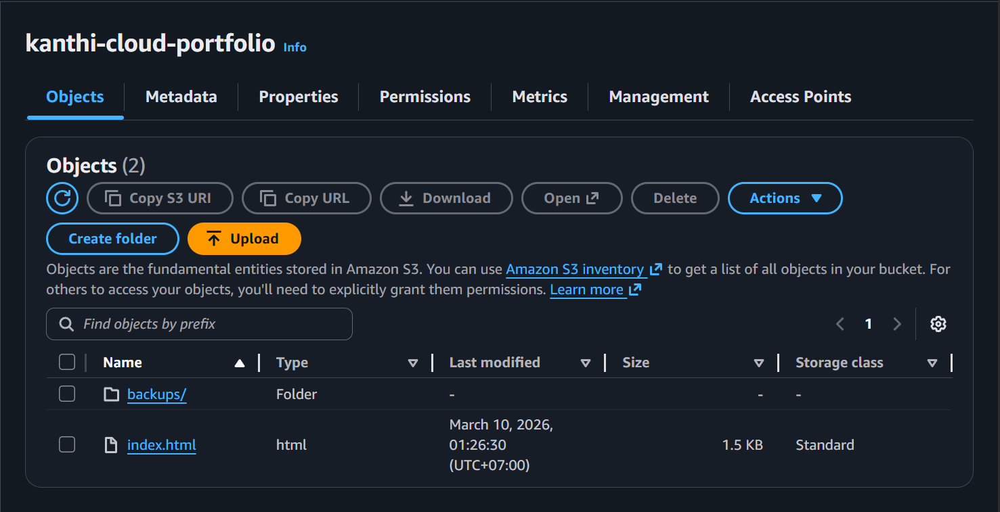

# ☁️ Project #2 — AWS S3 Bucket Setup

**Author:** Kanthi Phoosorn  
**Date:** March 10, 2026  
**Part of:** [Cloud-Security-Engineer Portfolio](https://github.com/KanthiPhoosorn/Cloud-Security-Engineer)

## 📋 What I Did
- Created AWS Free Tier account
- Created S3 bucket: kanthi-cloud-portfolio
- Configured bucket settings and permissions
- Region: Asia Pacific Sydney (ap-southeast-2)

## 🛠️ Technologies Used
- AWS S3
- AWS Console

## 📸 Screenshot

## 🔗 Related Projects
- [Project #3 — Static Website on S3](https://github.com/KanthiPhoosorn/AWS-Static-Website)
- [Project #5 — Auto Backup to S3](https://github.com/KanthiPhoosorn/AWS-Auto-Backup-S3)

## 💡 What I Learned
- AWS S3 bucket creation and configuration
- Cloud storage fundamentals
- AWS free tier management
